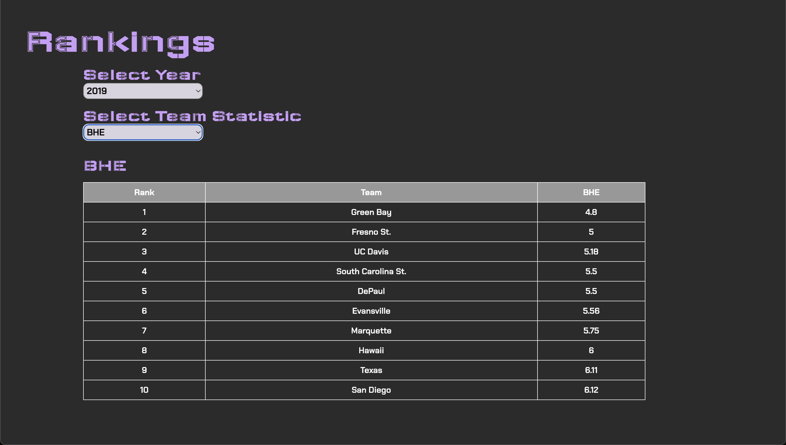

# 🏐 VolleyViz 🏐

VolleyViz is a volleyball performance analysis system that leverages NCAA college stats and machine learning to simulate games. Whether you're a fan wanting to engage with the game on a deeper level or a coach looking to analyze matchups, VolleyViz offers an interactive and user-friendly web app to visualize and explore team and player stats.

## Table of Contents

- [Features](#🌟-features)
- [Navigation](#🗺️-navigation)
- [Technologies](#💻-technologies)
- [Contributing](#🤝-contributing)
- [Areas of Improvement](#🎯-areas-of-improvement)

## 🌟 Features

- **Game Simulation**: Use machine learning models to simulate volleyball games based on NCAA stats.
- **Interactive Dashboard**: Explore team and player statistics in a visually engaging way.
- **Matchup Visualization**: Visualize potential matchups and see how teams are forecasted to perform against each other.
- **User-Friendly Interface**: Designed for both fans and coaches with easy-to-navigate features.

## 🗺️ Navigation

VolleyViz consists of several key pages to help you engage with and analyze volleyball stats:

### **Rankings Page**: View and explore team rankings based on various metrics.
   
   

### **Team Selection Page**: Select teams to view detailed statistics and compare their performance.
   
   

### **Stat Dashboard Page**: Access a comprehensive dashboard displaying team and player stats.
   
   

### Matchup Output Page

a. **Matchup Page**: Visualize and analyze simulated matchups between teams.
   
   

b.  **Win Prediction Component**: Predicts the winning team and the forecasted number of sets.
   
   

c. **Forecasted Statline**: Provides a detailed statline for the matchup as well as a computed metric for comparing the teams' performance.
   
   

d. **Offensive and Defensive Advice**: Offers strategic advice for the losing team to improve both offensive and defensive play.
   
   

## 💻 Technologies

- **Frontend**: React.js
- **Backend**: Flask
- **Data Processing**: Pandas
- **Machine Learning**: Scikit-learn, Keras

## 🤝 Contributing

Below are the key roles and team members involved in this project:  

- **Project Manager**: Arnav Akula 
- **Project Members**: Ruba Thekkath, Ankita Khatri, Nikhil Karthikeyan 
- **Media Member(s)**: Lauren Lee 
- **Business Member(s)**: Akshay Raj

## 🎯 Areas of Improvement

1. **Tailoring to UC Davis Volleyball Teams**: Customizing the application specifically for UC Davis volleyball teams to enable coaches to use it as a training tool.

2. **Optimizing Stat Prediction Model**: Reducing the computational cost and memory footprint of our stat prediction model to improve performance and scalability.

3. **Enhancing Simulation Aspect**: Expanding upon the game simulation feature to make it more engaging and interactive for volleyball fanatics.

